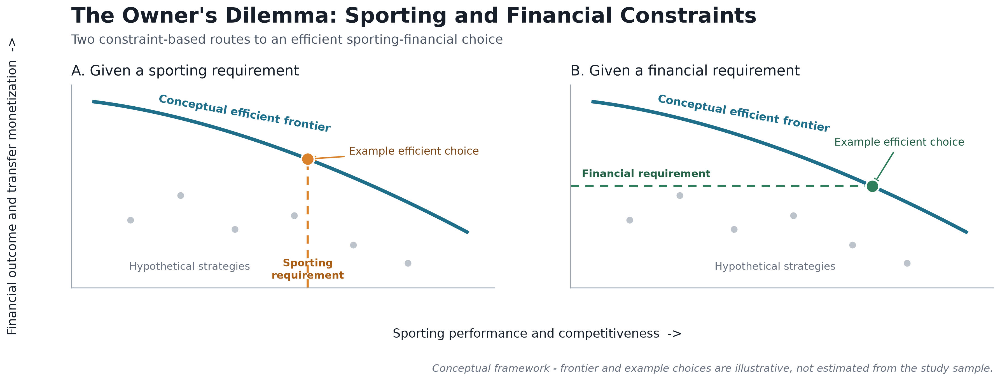
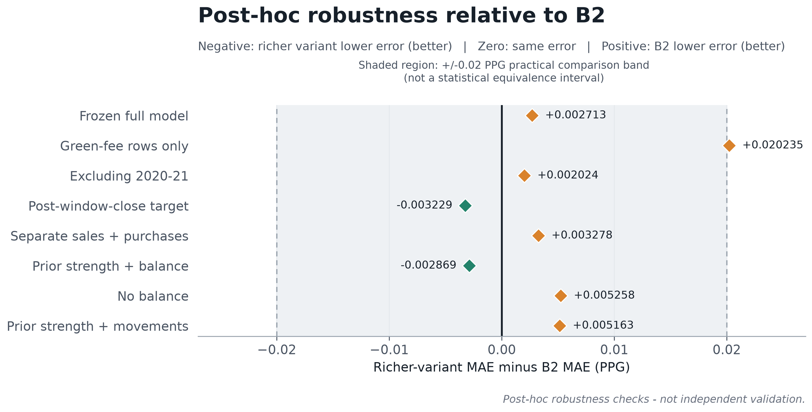

# The Owner's Dilemma: Testing Transfer-Window Signals for Sporting and Financial Decisions

This repository contains the public paper, final figures, aggregate results, and release-safe
reproduction code for MIT Sloan Sports Analytics Conference Problem 3. The study tests whether
aggregate summer transfer-window information improves forecasts of associated-season La Liga
points per game beyond transparent prior-strength baselines.

> **Reproducibility and data-rights notice.** Aggregate results and figure-generation code are
> included. Raw and row-level data are excluded because upstream redistribution and commercial-use
> rights require separate review. This is therefore a **partial reproduction package**, not an
> end-to-end public data release.

## Research collaboration

**This research was developed in collaboration with SoccerSolver. SoccerSolver currently works with more than 10 football clubs.**

## Research motivation

Football owners must balance transfer monetization against the squad strength needed for immediate
competition. A useful decision system would need to evaluate sporting and financial outcomes
together. Before such a system can be justified, its sporting-response model must add credible
predictive information beyond simple measures of prior team strength.

## The Owner's Dilemma

The paper represents efficient sporting-financial combinations with a Pareto frontier. One view
starts with a minimum sporting requirement and identifies the strongest compatible financial
outcome. The other starts with a financial requirement and identifies the strongest compatible
sporting outcome.

The frontier and highlighted choices below are conceptual. They were not estimated from the study
sample and do not identify an optimal transfer strategy.



*Figure 1. Conceptual representation of the Owner's Dilemma. The frontier, hypothetical strategies,
and highlighted choices are illustrative and were not estimated from the study sample.*

## Empirical objective

The empirical experiment evaluates whether aggregate summer-window financial and activity signals
improve forecasts of associated-season La Liga PPG beyond transparent prior-strength baselines.
The study is predictive and observational; it does not estimate causal transfer effects.

## Dataset and chronological evaluation

The analytical sample contains **159 La Liga club-by-summer-window observations** across eight
seasons, from **2017-18 through 2024-25**. The chronological design uses:

- 99 training observations;
- 40 validation observations; and
- a 20-club held-out test from the 2024-25 season.

The primary outcome is associated-season La Liga PPG. Mean absolute error in PPG is the primary
metric, and lower MAE is better.

Raw and row-level sporting and transaction records are not included. See
[`docs/data_provenance.md`](docs/data_provenance.md).

## Models and baselines

The comparisons include mean PPG, persistence, and B2, a compact prior-strength baseline. The richer
ordinary-least-squares model includes prior strength, promotion status, known-fee transfer balance,
movement counts, fee coverage, and COVID-era context.

Known-fee transfer balance is **known sales fees minus known purchase fees**. It is not accounting,
operating, or club profit. It excludes wages, amortization, agent fees, bonuses, payment timing,
and other costs.

## Main results

Validation favored B2, with MAE **0.219931**, compared with **0.226723** for the richer model.

| Model | Held-out MAE (PPG) |
|---|---:|
| Mean PPG | 0.361310 |
| Persistence | 0.271571 |
| B2 prior-strength baseline | **0.238262** |
| Richer transfer-window model | 0.240975 |

The richer model improves over persistence by **0.030596 PPG MAE**. B2 remains better than the
richer model by **0.002713 PPG MAE**. The richer model is therefore not the held-out winner.

## Robustness and sensitivity

Figure 2 plots richer-variant MAE minus B2 MAE. Negative values favor the richer variant; positive
values favor B2. The shaded +/-0.02 PPG region is a **practical comparison band**, not a statistical
equivalence interval. These analyses are post-hoc checks rather than independent validation.



*Figure 2. Post-hoc robustness relative to B2. Across the core variants, the richer specifications
show no stable material advantage over the compact baseline.*

## Interpretation

Aggregate transfer-window totals add context and improve upon naive persistence, but they do not
reliably outperform compact prior strength. This negative result sets a useful evidence boundary:
window-level totals alone are insufficient to validate an owner-facing sporting-financial
optimizer.

### What the study establishes

- A leakage-controlled chronological forecast comparison for 159 club-window observations.
- A held-out improvement over persistence for the richer specification.
- No held-out improvement over B2.
- No stable material advantage over B2 across the reported post-hoc checks.

### What the study does not establish

- An empirical efficient frontier or universally optimal owner choice.
- A validated sell/retain optimizer, optimal sale amount, or safe-to-sell threshold.
- A validated generator of alternative transfer-window scenarios.
- A causal effect of transfer activity on sporting performance.

A future optimization framework would require player-level departures and arrivals, player quality,
roles, minutes, replacement quality, transfer type, contract context, richer financial information,
and realistic counterfactual windows.

## Paper

The final two-page paper is available at
[`paper/Problem3_The_Owners_Dilemma.pdf`](paper/Problem3_The_Owners_Dilemma.pdf).

## Repository structure

```text
assets/      Researcher photograph and collaboration logo
docs/        Methodology, provenance, limitations, and reproduction notes
figures/     Final publication figures in PNG and SVG formats
paper/       Final public paper
results/     Aggregate, non-row-level scientific results
scripts/     Release verification
src/         Public-safe figure reproduction code
```

## Reproduction

Python 3.12 was used for release testing.

```bash
python -m venv .venv
source .venv/bin/activate
python -m pip install -r requirements.txt
python scripts/verify_release.py
python src/build_figures.py
```

The validator checks the public aggregate tables, headline values, required files, relative paths,
and release-safety conditions. Figure generation uses only the included aggregate robustness table
and conceptual inputs. Full reconstruction of the analytical dataset and model fit requires
authorized access to the underlying source data. See
[`docs/reproducibility.md`](docs/reproducibility.md).

## Limitations

The evaluation contains one 20-club held-out season. Associated-season PPG is not a perfectly pure
post-deadline outcome because league play can begin before the window closes. Published fees can be
reported or estimated, missing fees remain unknown, and known-fee balance omits material accounting
items. The robustness analyses are post-hoc. See [`docs/limitations.md`](docs/limitations.md).

---

## Researcher

<p align="left">
  
</p>

### Rupayan Halder

**PhD Student — Jadavpur University, Kolkata**  
**Football AI Researcher**  
**Assistant Professor — University of Engineering & Management (UEM), Kolkata**  
**Research Collaborator — SoccerSolver**  
**Former Software Engineer — Platform Engineering — Session AI**

Rupayan's research interests focus on applying artificial intelligence, machine learning, data
analytics, and computational methods to real-world problems in football, including player
performance analysis, recruitment, transfer-market decision-making, and sporting strategy.

### Connect

[GitHub](https://github.com/RupayanHalder39) ·
[LinkedIn](https://www.linkedin.com/in/rupayan-halder-962922209/) ·
[Email](mailto:rupayanhalder313239@gmail.com)

---

## Research Collaboration

<p align="left">
  
</p>

The collaboration acknowledgement is stated near the beginning of this README. Collaboration does
not imply ownership of third-party data or authorship by unspecified individuals.

---

## Citation

Please cite the repository using [`CITATION.cff`](CITATION.cff).

## Licence

Repository code is provided under the MIT License. The license does not grant rights to the paper,
third-party datasets, names, marks, photographs, or external assets. No raw or row-level data are
distributed in this repository.
